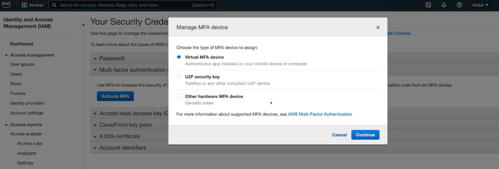
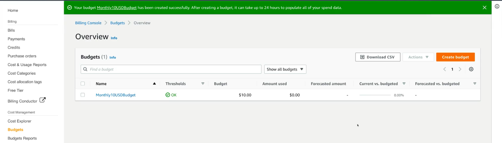

### AWS Accounts

An AWS account can be thought of as an isolated container. When you create a new AWS account, a new "account root user" is created that has all privileges in this account. During the sign-up process, you'll be asked to set up root user password. Once completed, you can then log in to your newly created AWS account as the root user.

### Securing an Account

To secure an an account, we will use multi-factor authentication (MFA). MFA device (smartphone, app etc) generates a code (auto-generated every 30 seconds) that is needed in addition to our username and password to log into an account. To enable MFA, you need to navigate to IAM and activate MFA.

With this enabled, you've secured your root user account. This is recommended since the root user has full privileges in an AWS account.

### Budget

It is recommended to create a budget so that you get alerts/alarms when you breach a certain threshold (50% of budget amount etc).

